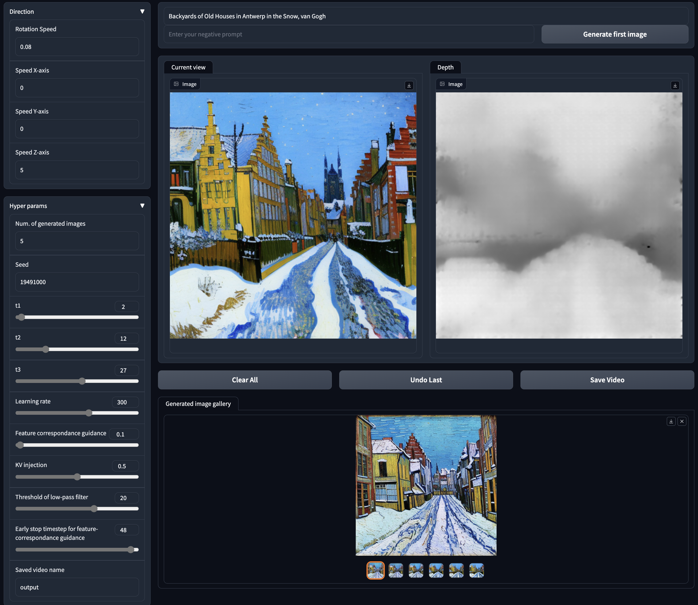
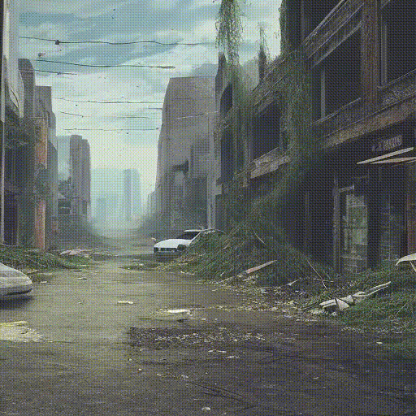
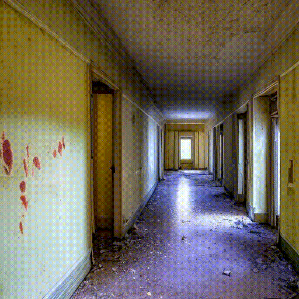
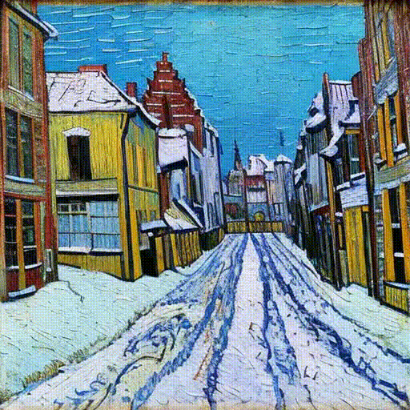

# DreamDrone

> *zero-shot training-free text-to-perceptual scene generation.*

[[Project Page](https://hyokong.github.io/dreamdrone-page/)] [[](https://huggingface.co/spaces/imsuperkong/dreamdrone)] [[Paper](https://arxiv.org/abs/2312.08746)]

<!-- <iframe width="560" height="315" src="figs/project-page.mp4" frameborder="0" allow="accelerometer; autoplay; encrypted-media; gyroscope; picture-in-picture" allowfullscreen></iframe> -->

<!--  -->

<!--  -->
This repository is the official implementation of [DreamDrone](https://arxiv.org/abs/2312.08746).


<!-- **[](https://arxiv.org/abs/2312.08746)**
</br>
[Hanyang Kong](https://hyokong.github.io/),
[Dongze Lian](https://dongzelian.com), 
Michael Bi Mi, 
[Xinchao Wang](https://sites.google.com/site/sitexinchaowang/)
</br> -->

<table class="center">
<tr>
  <td></td>
  <td></td>
  <td></td>              
  <td></td>
  <td></td>
</tr>
<tr>
  <td width=20% align="center">a desolate street in a Doomsday ruins style.</td>
  <td width=20% align="center">aerial view of city, lego style, high-resolution.</td>
  <td width=20% align="center">a winding trail in a fairy tale forest.</td>
  <td width=20% align="center">a wide boulevard in a retro-futuristic style.</td>
  <td width=20% align="center">a mountain village in the Japanese Ukiyo-e woodblock print style.</td>
</tr>


<tr>
  <td></td>
  <td></td>
  <td></td>              
  <td></td>
  <td></td>
</tr>
<tr>
  <td width=20% align="center">a corridor in a medieval castle.</td>
  <td width=20% align="center">a grand hallway in a Baroque-style palace.</td>
  <td width=20% align="center">a high building in a Steampunk world.</td>
  <td width=20% align="center">a long, narrow corridor in an abandoned hospital from a horror game.</td>
  <td width=20% align="center">Backyards of Old Houses in Antwerp in the Snow, van Gogh.</td>
</tr>
</table>

## ToDo

- [ ] To add LCM to the pipeline for faster generating speed.
- [ ] To add temporal filter for enhancing the smoothness of the generated videos.

## News

* [15/12/2023] Paper [DreamDrone](https://arxiv.org/abs/2312.08746) released!
* [15/12/2023] Our [huggingface demo](https://huggingface.co/spaces/PAIR/Text2Video-Zero) is released!

## Setup

1. Clone this repository and enter:

``` shell
git clone https://github.com/HyoKong/DreamDrone.git
cd DreamDrone/
```
2. Install requirements using Python 3.8 and CUDA >= 11.7
``` shell
conda create -n DreamDrone python=3.8 -y
pip install -r requirements.txt
```

## Inference API


To run Gradio interface

``` shell
python app.py
```

## BibTeX
If you use our work in your research, please cite our publication:
```
@misc{kong2023dreamdrone,
        title={DreamDrone}, 
        author={Hanyang Kong and Dongze Lian and Michael Bi Mi and Xinchao Wang},
        year={2023},
        eprint={2312.08746},
        archivePrefix={arXiv},
        primaryClass={cs.CV}
    }
```

We warmly welcome contributions from everyone. Please feel free to reach out to us.

***Without further ado, welcome to DreamDrone – enjoy piloting your virtual drone through imaginative landscapes!***


